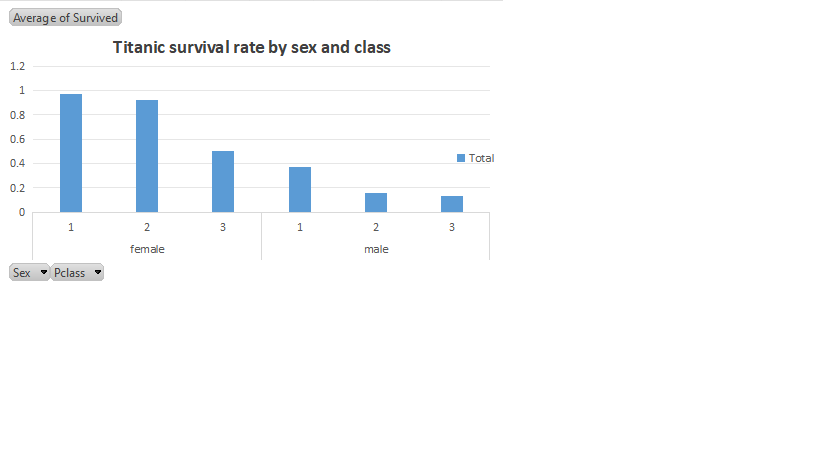

# Titanic Survival Analysis

## Overview
This project analyzes passenger data from the Titanic to understand which factors influenced survival, using Excel pivot tables and charts.

## Question
Did gender and passenger class affect a person's chance of surviving the Titanic disaster?

## Data Source
[Titanic Dataset - Kaggle](https://www.kaggle.com/competitions/titanic/data)

## Tools Used
- Microsoft Excel (Pivot Tables, Charts)

## Key Findings

1. **Gender had a major impact on survival.** Women survived at a rate of 74.2%, compared to only 18.9% for men.

2. **Passenger class also mattered, but gender mattered more.** Even 3rd class women (50% survival) had a better survival rate than 1st class men (36.9%).

3. **Survival rate by sex and class:**

   | Sex    | Class | Survival Rate |
   |--------|-------|----------------|
   | Female | 1st   | 96.8%          |
   | Female | 2nd   | 92.1%          |
   | Female | 3rd   | 50.0%          |
   | Male   | 1st   | 36.9%          |
   | Male   | 2nd   | 15.7%          |
   | Male   | 3rd   | 13.5%          |

## Chart

## What I Learned
This was my first data analysis project. I learned how to build pivot tables in Excel, calculate survival rates using averages, and turn raw data into visual insights. This project shows how historical events (like the "women and children first" policy) can be verified and quantified using data.
